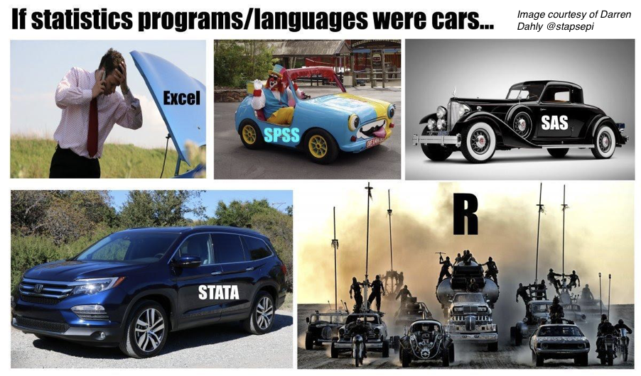

```{r setup, include=FALSE}
options(htmltools.dir.version = FALSE)
```

```{r, message=FALSE, warning=FALSE, echo=FALSE}
library(tidyverse)
library(gganimate)
library(gapminder)
library(NHANES)
library(datasets)
library(knitr)
library(kableExtra)
library(Hmisc)
library(broom)
library(gridExtra)
library(readxl)
library(ggthemes)
library(visdat)
library(plotly)
library(tidytext)
library(gutenbergr)
library(wordcloud)
library(rtweet)
library(leaflet)
library(RColorBrewer)
library(bbplot)
library(grid)
library(MASS)
```
class: center
# Science that can be replicated <i>vs.</i> science that can be reproduced

.left[
<b>Replicable Science</b> is when someone else can run a study the same as or conceptually equivalent to your one, and find a similar pattern of effects.

<b>Reproducible Science</b> is when someone else can take your data and your analysis code, run it and then find the same effects that you have reported. 
]

--
<b>How do we make our science more replicable?

How do we make our science more reproducible?</b>

---
# A move towards open science…

You really should read this book!

.pull-left[
```{r, echo=FALSE, out.width="80%"}

```
]

.pull-right[<br><br>Sins include <i>p</i>-hacking, lack of power, HARKing, failing (refusal) to share data and code, too many researcher degrees of freedom…
]

---
```{r, echo=FALSE, out.width="80%"}

```

http://www.stat.columbia.edu/~gelman/

Andrew Gelman gives the following recommendations to researchers:

- Analyze all your data.
- Present all your comparisons.
- Put in the effort to take accurate measurements (low bias, low variance, and a large enough sample size).
- Do repeated-measures comparisons where possible.
- Make your data public.

But it's not just the data you need to make public, but also your <b>code</b>!
---
# What role can R play in Open and Reproducible Science?

- R scripts are easy to share allowing for reproducibility and easy public sharing of data and code. 

- R is free, open source software that is much more flexible and powerful than SPSS.

- There is an active R community continuously updating statistical tests and packages that run in R.

- As R is a programming language, it forces you to <b>know</b> your data.
---
# R <i>vs.</i> SPSS

.middle[
“SPSS is like a bus - easy to use for the standard things, but very frustrating if you want to do something that is not already pre-programmed.

R is a 4-wheel drive off-roader, with a bike on the back, a kayak on top, good walking and running shoes in the passenger seat, and mountain climbing and spelunking gear in the back.

R can take you anywhere you want to go if you take time to learn how to use the equipment, but that is going to take longer than learning where the bus stops are in SPSS.” <i>(Greg Snow, 2010, stackoverflow.com)</i>
]
---
# In meme form…

```{r, echo=FALSE}

```
---
# A workflow for reproducible science in the Tidyverse

.center[
```{r, echo=FALSE, out.width="90%"}
knitr::include_graphics("images/tidyverse.png")
```
]
---
# A workflow for reproducible science in the Tidyverse

```{r, echo=FALSE}

```


https://www.tidyverse.org

---
class: center, middle
# Why Data Visualisation is Important
---
class: center, middle
# Anscombe's Quartert
---
# Plot 1
.pull-left[
```{r, echo=FALSE}
anscombe %>%
  ggplot(aes(x = x1, y = y1)) +
  geom_point(size = 5) +
  geom_smooth(method = "lm", se = FALSE) +
  labs(x = "X", y = "Y") +
  theme_grey(base_size = 22) +
  ylim(3, 13) +
  xlim(3, 15)
```
]

.pull-right[
```{r, echo=FALSE}
paste0("Mean of X is: ", round(mean(anscombe$x1), 2))
paste0("SD of X is: ", round(sd(anscombe$x1), 2))
paste0("Mean of Y is: ", round(mean(anscombe$y1), 2))
paste0("SD of Y is: ", round(sd(anscombe$y1), 2))
```
]
```{r, echo=FALSE}
paste0("Pearson's r is ", round(tidy(rcorr(anscombe$x1, anscombe$y1))$estimate,2))
```

---
# Plot 2
.pull-left[
```{r, echo=FALSE}
anscombe %>%
  ggplot(aes(x = x2, y = y2)) +
  geom_point(size = 5) +
  geom_smooth(method = "lm", se = FALSE) +
  labs(x = "X", y = "Y") +
  theme_grey(base_size = 22) +
  ylim(3, 13) +
  xlim(3, 15)
```
]
.pull-right[
```{r, echo=FALSE}
paste0("Mean of X is: ", round(mean(anscombe$x2), 2))
paste0("SD of X is: ", round(sd(anscombe$x2), 2))
paste0("Mean of Y is: ", round(mean(anscombe$y2), 2))
paste0("SD of Y is: ", round(sd(anscombe$y2), 2))
```
]
```{r, echo=FALSE}
paste0("Pearson's r is ", round(tidy(rcorr(anscombe$x2, anscombe$y2))$estimate,2))
```

---
# Plot 3
.pull-left[
```{r, echo=FALSE}
anscombe %>%
  ggplot(aes(x = x3, y = y3)) +
  geom_point(size = 5) +
  geom_smooth(method = "lm", se = FALSE) +
  labs(x = "X", y = "Y") +
  theme_grey(base_size = 22) +
  ylim(3, 13) +
  xlim(3, 15)
```
]
.pull-right[
```{r, echo=FALSE}
paste0("Mean of X is: ", round(mean(anscombe$x3), 2))
paste0("SD of X is: ", round(sd(anscombe$x3), 2))
paste0("Mean of Y is: ", round(mean(anscombe$y3), 2))
paste0("SD of Y is: ", round(sd(anscombe$y3), 2))
```
]
```{r, echo=FALSE}
paste0("Pearson's r is ", round(tidy(rcorr(anscombe$x3, anscombe$y3))$estimate,2))
```

---
# Plot 4
.pull-left[
```{r, echo=FALSE}
anscombe %>%
  ggplot(aes(x = x4, y = y4)) +
  geom_point(size = 5) +
  geom_smooth(method = "lm", se = FALSE) +
  labs(x = "X", y = "Y") +
  theme_grey(base_size = 22) +
  ylim(3, 13) +
  xlim(3, 20)
```
]
.pull-right[
```{r, echo=FALSE}
paste0("Mean of X is: ", round(mean(anscombe$x4), 2))
paste0("SD of X is: ", round(sd(anscombe$x4), 2))
paste0("Mean of Y is: ", round(mean(anscombe$y4), 2))
paste0("SD of Y is: ", round(sd(anscombe$y4), 2))
```
]
```{r, echo=FALSE}
paste0("Pearson's r is ", round(tidy(rcorr(anscombe$x4, anscombe$y4))$estimate,2))
```

---
# Plots Based on Aggregated Data Can Mislead…

```{r, echo=FALSE}
Subject <- seq(1:80)
Group <- factor(rep(1,80))
set.seed(1234)
RT <- c(rnorm(40,500,200), rnorm(40,1900,200))
data1 <- tibble(Subject, Group, RT)
```

.center[
```{r, fig.height = 5}
ggplot(data1, aes(x = Group, y = RT)) + geom_boxplot() 
```
]
---
# But look more closely at the actual data…

.center[
```{r, echo=FALSE}
p1 <- ggplot(data1, aes(x = Group, y = RT)) + geom_jitter(size = 2, width = .1, alpha = .5)
p2 <- ggplot(data1, aes(x = Group, y = RT)) + geom_boxplot() + geom_jitter(size = 2, width = .1, alpha = .5)
p3 <- ggplot(data1, aes(x = Group, y = RT)) + geom_violin() + geom_jitter(width = .1, alpha = .75)
grid.arrange(p1, p2, p3, nrow = 1)
```
]
---
# The distribution of data matters

The data on the previous slide are clearly bimodal with no data point near the mean.  Distribution shape matters and we need to capture that in our data visualisations.

If we only plotted and reported information related to aggregated data, we wouldn't be being honest about what our data look like.
---
# Reasons for visualising data

--

For yourself - once you have collected your data, you should visualise it before you build any statistical models - does the data look (roughly) as expected with the right number of data points?

--

For others - when you present your work in a talk, on a poster, or in a published paper you want the viewer to be able to quickly and unambiguously extract the intended meaning from your visualisation.  

--

Just as the reproducibilty of statistical models is important in the context of engaging in open and reproducible science, so too is the reproducibilty of data visualisations.


---

# ggplot2

The ggplot2 package is part of the Tidyverse and is based around the Grammar of Graphics (Wickham, 2010):

https://byrneslab.net/classes/biol607/readings/wickham_layered-grammar.pdf

Start with defining your data and aesthetics of the plot, before adding geometric objects (geoms), information about labelling, faceting etc.

Each plot can be built up gradually, layer by layer like the following:

---
```{r, echo=FALSE}
set.seed(1234)
ID <- rep(seq(1:48), 2)
Simple <- as.integer(rnorm(48, mean = 2000, sd = 140))
Complex <- as.integer(rnorm(48, mean = 2400, sd = 160))
Condition <- c(rep("Simple", 48), rep("Complex", 48))
data_long <- tibble(ID, Condition, c(Simple, Complex))
colnames(data_long)[3] <- "RT"
```

.top[
```{r, echo=FALSE, fig.height=5}
ggplot(data_long, aes(x = Condition, y = RT)) +
  geom_jitter(alpha = .25, position = position_jitter(0.05)) +
  theme_grey(base_size = 22)
```
]

.bottom[
```{r, eval=FALSE}
ggplot(data_long, aes(x = Condition, y = RT)) +
  geom_jitter(alpha = .25, position = position_jitter(0.05))
```
]

---
.top[
```{r, echo=FALSE, fig.height=5}
ggplot(data_long, aes(x = Condition, y = RT)) +
  geom_jitter(alpha = .25, position = position_jitter(0.05)) +
  stat_summary(fun.data = "mean_cl_boot", colour = "black", 
               size = 1) +
  theme_grey(base_size = 22)
```
]

.bottom[
```{r, eval=FALSE}
ggplot(data_long, aes(x = Condition, y = RT)) +
  geom_jitter(alpha = .25, position = position_jitter(0.05)) +
  stat_summary(fun.data = "mean_cl_boot", colour = "black", 
               size = 1) 
```
]
---
.top[
```{r, echo=FALSE, fig.height=5}
ggplot(data_long, aes(x = Condition, y = RT)) +
  geom_jitter(alpha = .25, position = position_jitter(0.05)) +
  stat_summary(fun.data = "mean_cl_boot", colour = "black", 
               size = 1) +
  geom_violin(aes(fill = Condition), alpha = .2) +
  theme_grey(base_size = 22)
```
]

.bottom[
```{r, eval=FALSE}
ggplot(data_long, aes(x = Condition, y = RT)) +
  geom_jitter(alpha = .25, position = position_jitter(0.05)) +
  stat_summary(fun.data = "mean_cl_boot", colour = "black", 
               size = 1) +
  geom_violin(aes(fill = Condition), alpha = .2)
```
]
---
.top[
```{r, echo=FALSE, fig.height=5}
ggplot(data_long, aes(x = Condition, y = RT)) +
  geom_jitter(alpha = .25, position = position_jitter(0.05)) +
  stat_summary(fun.data = "mean_cl_boot", colour = "black", 
               size = 1) +
  geom_violin(aes(fill = Condition), alpha = .2) +
  guides(fill = FALSE) +
  theme_grey(base_size = 22)
```
]

.bottom[
```{r, eval=FALSE}
ggplot(data_long, aes(x = Condition, y = RT)) +
  geom_jitter(alpha = .25, position = position_jitter(0.05)) +
  stat_summary(fun.data = "mean_cl_boot", colour = "black", 
               size = 1) +
  geom_violin(aes(fill = Condition), alpha = .2) +
  guides(fill = FALSE)
```
]

---
.top[
```{r, echo=FALSE, fig.height=5}
ggplot(data_long, aes(x = Condition, y = RT)) +
  geom_jitter(alpha = .25, position = position_jitter(0.05)) +
  stat_summary(fun.data = "mean_cl_boot", colour = "black", 
               size = 1) +
  geom_violin(aes(fill = Condition), alpha = .2) +
  guides(fill = FALSE) +
  theme_grey(base_size = 22) + 
  coord_flip()
```
]

.bottom[
```{r, eval=FALSE}
ggplot(data_long, aes(x = Condition, y = RT)) +
  geom_jitter(alpha = .25, position = position_jitter(0.05)) +
  stat_summary(fun.data = "mean_cl_boot", colour = "black", 
               size = 1) +
  geom_violin(aes(fill = Condition), alpha = .2) +
  guides(fill = FALSE) + 
  coord_flip()
```
]

---
# Violin Plots

These are Violin Plots - these are an example of an RDI plot as they capture the Raw data, information about the Distribution, and some Inferential statistics (e.g., Confidence Intervals).

We can modify other characteristics of the plot such as the colour palette we're using, the orientation, and we can also add some labels:

```{r, echo=FALSE}
set.seed(1234)
ID <- rep(seq(1:48), 2)
Simple <- as.integer(rnorm(48, mean = 2000, sd = 140))
Complex <- as.integer(rnorm(48, mean = 2400, sd = 160))
Condition <- c(rep("Simple", 48), rep("Complex", 48))
data_long <- tibble(ID, Condition, c(Simple, Complex))

colnames(data_long)[3] <- "RT"
```

```{r, echo=FALSE, fig.height=4}
ggplot(data_long, aes(x = Condition, y = RT)) + 
  geom_violin(aes(fill = Condition)) + 
  geom_jitter(alpha = .25, position = position_jitter(0.05)) + 
  guides(fill = FALSE) +
  stat_summary(fun.data = "mean_cl_boot", colour = "black", 
               size = 1) +
  scale_fill_brewer(palette = "Accent") +
  coord_flip() +
  theme_grey(base_size = 22) +
  labs(x = "Condition", y = "Reaction Time (ms.)")
```
---
# Building interactive visualisations using the plotly package

.center[
```{r, echo=FALSE}
 
p <- ggplot(data_long, aes(x = Condition, y = RT, label = ID)) + 
  geom_violin(aes(fill = Condition)) + 
  geom_jitter(alpha = .25, position = position_jitter(0.05)) + 
  stat_summary(fun.data = "mean_cl_boot", colour = "black", 
               size = 1) +
  scale_fill_brewer(palette = "Accent") +
  coord_flip() +
  theme_grey(base_size = 22) +
  labs(x = "Condition", y = "Reaction Time (ms.)") +
  theme_classic()

ggplotly(p, width = 800, height = 400)

```
]

---
# Raincloud Plots
```{r, echo=FALSE, fig.height=5, fig.width=7}
source("https://gist.githubusercontent.com/ajstewartlang/6c4cd8ab9e0c27747424acdfb3b4cff6/raw/fb53bd97121f7f9ce947837ef1a4c65a73bffb3f/geom_flat_violin.R")

set.seed(1234)
ID <- rep(seq(1:48), 2)
Simple <- as.integer(rnorm(48, mean = 2000, sd = 140))
Complex <- as.integer(rnorm(48, mean = 2400, sd = 160))
Condition <- c(rep("Simple", 48), rep("Complex", 48))
data_long <- tibble(ID, Condition, c(Simple, Complex))

colnames(data_long)[3] <- "RT"

raincloud_theme = theme(
  text = element_text(size = 12),
  axis.title.x = element_text(size = 12),
  axis.title.y = element_text(size = 12),
  axis.text = element_text(size = 12),
  axis.text.x = element_text(angle = 45, vjust = 0.5),
  legend.title = element_text(size = 12),
  legend.text = element_text(size = 12),
  legend.position = "right",
  plot.title = element_text(lineheight = .8, face = "bold", size = 16),
  panel.border = element_blank(),
  panel.grid.minor = element_blank(),
  panel.grid.major = element_blank(),
  axis.line.x = element_line(colour = 'black', size = 0.5, linetype = 'solid'),
  axis.line.y = element_line(colour = 'black', size = 0.5, linetype = 'solid'))

lb <- function(x) mean(x) - sd(x)
ub <- function(x) mean(x) + sd(x)

sumld <- plyr::ddply(data_long, ~ Condition, summarise, mean = mean(RT), median = median(RT), 
               lower = lb(RT), upper = ub(RT))

ggplot(data_long, aes(y = RT, x = Condition, fill = Condition)) +
  geom_flat_violin(position = position_nudge(x = .2, y = 0), alpha = .8, trim=FALSE) +
  geom_point(aes(y = RT, color = Condition), position = position_jitter(width = .15), size = .5, alpha = 0.8) +
  geom_boxplot(width = .1,  outlier.shape = NA, alpha = 0.5) +
  expand_limits(x = 3) +
  guides(fill = FALSE) +
  guides(color = FALSE) +
  scale_color_brewer(palette = "Accent") +
  scale_fill_brewer(palette = "Accent") +
  coord_flip() +
  theme_bw() +
  raincloud_theme +
  labs(x=NULL) +
  scale_y_continuous(breaks = seq(1500,3000,by = 200))
```

.footnote[Allen M, Poggiali D, Whitaker K et al. Raincloud plots: a multi-platform tool for robust data visualization [version 1; peer review: 2 approved]. Wellcome Open Res 2019, 4:63
https://doi.org/10.12688/wellcomeopenres.15191.1
]

---
# Using Different Themes

You can change the ggplot theme to a number of built in ones (or define your own.)  

On the next page you'll see the same plot with (a) the Economics theme, (b) the fivethirtyeight theme, (c) the Tufte theme, and (d) the solarized theme. Below is the plot with the default theme.

.center[
```{r, echo=FALSE, fig.height=5, fig.width=7}
set.seed(1234)
ID <- rep(seq(1:48), 2)
Simple <- as.integer(rnorm(48, mean = 2000, sd = 140))
Complex <- as.integer(rnorm(48, mean = 2400, sd = 160))
Condition <- c(rep("Simple", 48), rep("Complex", 48))
data_long <- tibble(ID, Condition, c(Simple, Complex))

colnames(data_long)[3] <- "RT"

data_long %>%
  ggplot(aes(x = Condition, y = RT, colour = Condition)) +
  geom_violin(alpha = .2) +
  geom_boxplot(alpha = .1, width = .1) +
  geom_jitter(width = .1, colour = "black", alpha = .5) +
  coord_flip() +
  guides(colour = FALSE) +
  ggtitle("Default ggplot theme")
```
]

---
class: center, middle
```{r, echo=FALSE, fig.width=9}
set.seed(1234)
ID <- rep(seq(1:48), 2)
Simple <- as.integer(rnorm(48, mean = 2000, sd = 140))
Complex <- as.integer(rnorm(48, mean = 2400, sd = 160))
Condition <- c(rep("Simple", 48), rep("Complex", 48))
data_long <- tibble(ID, Condition, c(Simple, Complex))

colnames(data_long)[3] <- "RT"

data_long %>%
  ggplot(aes(x = Condition, y = RT, colour = Condition)) +
  geom_violin(alpha = .2) +
  geom_boxplot(alpha = .1, width = .1) +
  geom_jitter(width = .1, colour = "black", alpha = .5) +
  coord_flip() +
  guides(colour = FALSE) +
  theme_economist(base_size = 20) +
  ggtitle("Economist theme")

```

---
class: center, middle

```{r, echo=FALSE, fig.width=9}
data_long %>%
  ggplot(aes(x = Condition, y = RT, colour = Condition)) +
  geom_violin(alpha = .2) +
  geom_boxplot(alpha = .1, width = .1) +
  geom_jitter(width = .1, colour = "black", alpha = .5) +
  coord_flip() +
  guides(colour = FALSE) +
  theme_fivethirtyeight(base_size = 20) +
  ggtitle("Fivethirtyeight theme")
```

---
class: center, middle

```{r, echo=FALSE, fig.width=9}

data_long %>%
  ggplot(aes(x = Condition, y = RT, colour = Condition)) +
  geom_violin(alpha = .2) +
  geom_boxplot(alpha = .1, width = .1) +
  geom_jitter(width = .1, colour = "black", alpha = .5) +
  coord_flip() +
  guides(colour = FALSE) +
  theme_tufte(base_size = 20) +
  ggtitle("Tufte theme")

```

---
class: center, middle

```{r, echo=FALSE, fig.width=9}
data_long %>%
  ggplot(aes(x = Condition, y = RT, colour = Condition)) +
  geom_violin(alpha = .2) +
  geom_boxplot(alpha = .1, width = .1) +
  geom_jitter(width = .1, colour = "black", alpha = .5) +
  coord_flip() +
  guides(colour = FALSE) +
  theme_solarized(base_size = 20) +
  ggtitle("Solarized theme")
```
---
# The BBC Cookbook

The BBC (like many other organisations such as the FT) use R and ggplot to generate their data They have even published their own style guide and code for their BBC data visualisation theme.

https://bbc.github.io/rcookbook/
.center[
```{r, echo=FALSE, out.width="80%"}
knitr::include_graphics("images/bbc.png")
```
]

---
# World Happiness Data

```{r, echo=FALSE}
url1 <- "https://query.data.world/s/tw3oaknxjlqods27xzzbpa3do4rmfr"
p1f <- tempfile()
download.file(url1, p1f, mode="wb")
happy_data <- read_excel(path = p1f)
happy_data <- happy_data[1:6]
```
We can have a look at the World Happiness dataset that measures Happiness (called Life Ladder) and a bunch of other things (e.g., GDP) over countries over time.

.center[
```{r, fig.height=4}
vis_dat(happy_data)
```
]
---
.center[
```{r, fig.height=6}
vis_miss(happy_data)
```
]
---
.top[
```{r, echo=FALSE, fig.width=10, fig.height=4, message=FALSE}
happy_data %>% 
  group_by(country) %>%
  filter(!is.na(`Life Ladder`) & year == 2016) %>%
  summarise(score = `Life Ladder`) %>%
  mutate(country = reorder(country, score)) %>%
  top_n(20) %>%
  ggplot(aes(x = score, y = country)) + 
  geom_point() +
  labs(x = "Happiness Index Score", y = "Country", 
       title = "Top 20 Happiest Countries in 2016") +
  theme_tufte(base_size = 15) 
```
]
.bottom[
```{r, eval=FALSE}
happy_data %>% 
  group_by(country) %>%
  filter(!is.na(`Life Ladder`) & year == 2016) %>%
  summarise(score = `Life Ladder`) %>%
  mutate(country = reorder(country, score)) %>%
  top_n(20) %>%
  ggplot(aes(x = score, y = country)) + 
  geom_point() +
  labs(x = "Happiness Index Score", y = "Country", 
       title = "Top 20 Happiest Countries in 2016") +
  theme_tufte(base_size = 15) 
```
]
---
.top[
```{r, echo=FALSE, fig.width=10, fig.height=4}
country_list <- c("United Kingdom", "France", "Germany", 
                  "Italy", "Norway", "United States")
happy_data %>% 
  filter(country %in% country_list) %>%
  filter(!is.na(`Social support`)) %>%
  mutate(score = `Social support`) %>%
  mutate(country = reorder(country, score)) %>%
  ggplot(aes(y = score, x = country, fill = country)) + 
  geom_boxplot(width = .5) +
  labs(y = "Boxplot of Social support", x = "Country", 
       title = "Social support") +  
  guides(fill = FALSE) + 
  coord_flip() + theme_tufte(base_size = 15)
```
]
.bottom[
```{r, eval=FALSE}
country_list <- c("United Kingdom", "France", "Germany", 
                  "Italy", "Norway", "United States")
happy_data %>% 
  filter(country %in% country_list) %>%
  filter(!is.na(`Social support`)) %>%
  mutate(score = `Social support`) %>%
  mutate(country = reorder(country, score)) %>%
  ggplot(aes(y = score, x = country, fill = country)) + 
  geom_boxplot(width = .5) +
  labs(y = "Boxplot of Social support", x = "Country", 
       title = "Social support") +  
  guides(fill = FALSE) + 
  coord_flip() + theme_tufte(base_size = 15)
```
]
---
.top[
```{r, echo=FALSE, fig.width=10, fig.height=4}
happy_data %>% 
  filter(country %in% country_list) %>%
  group_by(country) %>%
  mutate(score = `Life Ladder`) %>%
  ungroup() %>%
  mutate(country = reorder(country, score)) %>%
  ggplot(aes(x = country, y = score)) + 
  geom_boxplot() +
  labs(x = "Country", y = "Happiness Index Score", 
       title = "Average Happiness Index for 6 Countries") +
  coord_flip() + theme_fivethirtyeight(base_size = 15)  
```
]
.bottom[
```{r, eval=FALSE}
happy_data %>% 
  filter(country %in% country_list) %>%
  group_by(country) %>%
  mutate(score = `Life Ladder`) %>%
  ungroup() %>%
  mutate(country = reorder(country, score)) %>%
  ggplot(aes(x = country, y = score)) + 
  geom_boxplot() +
  labs(x = "Country", y = "Happiness Index Score", 
       title = "Average Happiness Index for 6 Countries") +
  coord_flip() + theme_fivethirtyeight(base_size = 15)  
```
]
---
.top[
```{r, echo=FALSE, fig.width=10, fig.height=4}
country_list <- c("United Kingdom", "France", "Germany", 
                  "Italy", "Norway", "United States")
happy_data %>%
  filter(country %in% country_list) %>%
  group_by(year) %>%
  filter(!is.na(`Life Ladder`)) %>%
  ggplot(aes(x = year, y = `Life Ladder`)) +
  geom_line() +
  facet_wrap(~ country) +
  labs(x = "Year", y = "Happiness index", 
       title = "Happiness Index over Time for 6 Countries") +
  theme_fivethirtyeight(base_size = 15) +
  theme(axis.text.x = element_text(angle = 45, hjust = 1))
```
]
.bottom[
```{r, eval=FALSE}
country_list <- c("United Kingdom", "France", "Germany", 
                  "Italy", "Norway", "United States")
happy_data %>%
  filter(country %in% country_list) %>%
  group_by(year) %>%
  filter(!is.na(`Life Ladder`)) %>%
  ggplot(aes(x = year, y = `Life Ladder`)) +
  geom_line() +
  facet_wrap(~ country) +
  labs(x = "Year", y = "Happiness index", 
       title = "Happiness Index over Time for 6 Countries") +
  theme_fivethirtyeight(base_size = 15) +
  theme(axis.text.x = element_text(angle = 45, hjust = 1))
```
]
---
# Visualising Qualitative Data

Maybe you have lots of qualitative data and are interested in running a content analysis. In the next example, I'm examining all the text in HG Wells' The War of the Worlds.

.center[
```{r, echo=FALSE, warning=FALSE, message=FALSE, fig.width=8, fig.height=5}
# Get 2 HG Wells books ####
titles <- "The War of the Worlds"
books <- gutenberg_works(title %in% titles) %>%
  gutenberg_download(meta_fields = "title")

text_waroftheworlds <- books %>%
  unnest_tokens(word, text) %>%
  anti_join(stop_words) 

text_waroftheworlds %>%
  count(word) %>%
  top_n(10) %>%
  mutate(word = reorder(word, n)) %>%
  ggplot(aes(x = word, y = n, fill = word)) +
  geom_col() +
  coord_flip() +
  guides(fill = FALSE) +
  labs(title = "Top 10 words in The War of the Worlds")
```
]
---

```{r, eval=FALSE}
# Get 2 HG Wells books ####
titles <- "The War of the Worlds"
books <- gutenberg_works(title %in% titles) %>%
  gutenberg_download(meta_fields = "title")

text_waroftheworlds <- books %>%
  unnest_tokens(word, text) %>%
  anti_join(stop_words) 

text_waroftheworlds %>%
  count(word) %>%
  top_n(10) %>%
  mutate(word = reorder(word, n)) %>%
  ggplot(aes(x = word, y = n, fill = word)) +
  geom_col() +
  coord_flip() +
  guides(fill = FALSE) +
  labs(title = "Top 10 words in The War of the Worlds")
  
text_waroftheworlds_count <- text_waroftheworlds %>%
  count(word) %>%
  top_n(200)
```

---
.center[.middle[
```{r, echo=FALSE, warning=FALSE, message=FALSE}
  text_waroftheworlds_count <- text_waroftheworlds %>%
  count(word) %>%
  top_n(200)

set.seed(1234)
wordcloud(words = text_waroftheworlds_count$word, 
          freq = text_waroftheworlds_count$n, 
          min.freq = 1,
          scale = c(3, 1), 
          max.words = 125, 
          random.order = FALSE, 
          rot.per = 0.35, 
          colors = brewer.pal(8, "Dark2"))
```
]]

---
```{r, eval=FALSE}
set.seed(1234)
wordcloud(words = text_waroftheworlds_count$word, 
          freq = text_waroftheworlds_count$n, min.freq = 1,
          scale = c(3, 1), 
          max.words = 125, random.order = FALSE, 
          rot.per = 0.35, colors = brewer.pal(8, "Dark2"))
```

.center[
```{r, echo=FALSE}
set.seed(1234)
wordcloud(words = text_waroftheworlds_count$word, 
          freq = text_waroftheworlds_count$n, min.freq = 1,
          scale = c(3, 1), 
          max.words = 125, random.order = FALSE, 
          rot.per = 0.35, colors = brewer.pal(8, "Dark2"))
```
]
---
# Sentiment Analyis
```{r, echo=FALSE, message=FALSE, warning=FALSE}
sentiments <- get_sentiments("nrc")   #nrc for details - bing for positive vs negatives sentiment

word_counts <- text_waroftheworlds %>%
  inner_join(sentiments) %>%
  count(word, sentiment, sort = TRUE)
```

.center[
```{r, echo=FALSE, fig.width=10, fig.height=6}
word_counts %>% 
  filter(n > 20) %>%
  mutate(n = ifelse(sentiment == "negative", -n, n)) %>%
  mutate(word = reorder(word, n)) %>%
  ggplot(aes(word, n, fill = sentiment)) +
  geom_col() +
  coord_flip() +
  labs(y = "Contribution to sentiment", 
       title = "Sentiment Analysis of words in The War of the Worlds") 
```
]

---
```{r, eval=FALSE, message=FALSE}
sentiments <- get_sentiments("bing")

word_counts <- text_waroftheworlds %>%
  inner_join(sentiments) %>%
  count(word, sentiment, sort = TRUE)
```

```{r, eval=FALSE}
word_counts %>% 
  filter(n > 20) %>%
  mutate(n = ifelse(sentiment == "negative", -n, n)) %>%
  mutate(word = reorder(word, n)) %>%
  ggplot(aes(word, n, fill = sentiment)) +
  geom_col() +
  coord_flip() +
  labs(y = "Contribution to sentiment", 
    title = "Sentiment Analysis of Words in The War of the Worlds") 
```
---
# Visualising Data from Twitter

Scraping Twitter using the rtweet() package for everyone's favourite progressive Swedish death metal band, Opeth! 🤘  

<p>
```{r, echo=FALSE, message=FALSE, warning=FALSE}
rt <- search_tweets("Opeth", n = 2000, include_rts = FALSE, retryonratelimit = TRUE)
rt1 <- separate(data = rt, col = created_at, into = c("date", "time"), sep = " ") 
rt1 <- rt1[!is.na(rt1$date),]
rt1$date <- as.factor(rt1$date)
data <- rt1
```

.center[
```{r, echo=FALSE, message=FALSE, warning=FALSE, fig.height=6, fig.width=8}
img <- jpeg::readJPEG("images/opeth.jpg")
g <- rasterGrob(img, interpolate=TRUE) 

ggplot(data, aes (x = date)) + 
  annotation_custom(g, xmin = -Inf, xmax = Inf, ymin = -Inf, ymax = Inf) +
  geom_bar(fill = "white", alpha = .5) + 
  #scale_y_continuous(expand = c(0,0), limits = c(0, 250)) + 
  labs(x = "Day", y = "Number of Tweets") + 
  theme(axis.text.x = element_text(angle = 45, hjust = 1)) +
  ggtitle(paste("Tweets Mentioning Opeth scraped on", Sys.Date())) 
```
]
---
class: centre

# Geospatial Plotting of Tweets

```{r, echo=FALSE}
mymap <- lat_lng(rt)

m <- leaflet(mymap) %>% 
  addTiles()
```

.center[
```{r, echo=FALSE, message=FALSE, warning=FALSE, fig.height=6, fig.width=8}
m %>% addCircles(lng = ~lng, lat = ~lat, weight = 8, radius = 40, 
                 color = "#fb3004", stroke = TRUE, fillOpacity = 0.8)
```
]

---
class: middle, center
# Teaching with Animations

---
# Data Simulations and Data Visualisation - Hockey Game Simulation

Imagine a hockey game where we know that Team A scores exactly 1 goal for sure and Team B takes 20 shots, each with a 5.5% chance of going in.

Which team would you rather be?

(nothing additional happens if you tie.)

```{r, eval=FALSE}
set.seed(1234)

team_b_goals <- NULL

for(i in 1:10000) {
score <- sum(sample(c(1, 0), size = 20, replace = TRUE, 
                    prob = c(0.055, 1-.055)))
team_b_goals <- c(team_b_goals, score)}

team_a_goals <- rep(1, 10000)

all_games <- as_tibble(cbind(team_a_goals, team_b_goals))
```

---
```{r, echo=FALSE, warning=FALSE}
set.seed(1234)

team_b_goals <- NULL

for(i in 1:10000) {
score <- sum(sample(c(1, 0), size = 20, replace = TRUE, prob = c(0.055, 1-.055)))
team_b_goals <- c(team_b_goals, score)}

team_a_goals <- rep(1, 10000)

all_games <- as_tibble(cbind(team_a_goals, team_b_goals))
```

```{r, echo=FALSE}
paste("Games where Team A scores more goals than Team B: ", nrow(filter(all_games, team_a_goals > team_b_goals)))
paste("Games where Team A scores fewer goals than Team B: ", nrow(filter(all_games, team_a_goals < team_b_goals)))
paste("Games where there is a tie : ", nrow(filter(all_games, team_a_goals == team_b_goals)))
```

.center[
```{r, echo=FALSE, eval=TRUE}
all_games <- all_games %>% 
  mutate(team_a_wins = team_a_goals > team_b_goals,
         team_b_wins = team_b_goals > team_a_goals) 

all_games$game_number <- seq(1:10000)
all_games$team_a_wins <- cumsum(all_games$team_a_wins)
all_games$team_b_wins <- cumsum(all_games$team_b_wins)

small_data <- tibble(c(all_games$team_a_wins, all_games$team_b_wins), 
                    c(rep("Team_A", 10000), rep("Team_B", 10000)),
                    c(seq(1:10000), seq(1:10000)))

colnames(small_data) <- c("Points", "Team", "Game")

small_data %>% 
  ggplot(aes(x = Points, y = Game, group = Team, colour = Team)) +
  geom_point() +
  geom_line(size = 2) + 
  coord_flip() +
  transition_reveal(Game) +
  shadow_mark(past = TRUE) +
  labs(title = "Wins of Team A vs. Team B", 
       x = "Running total of wins",
       y = "Game number") +
  theme(text = element_text(size = 15))
```
]
---
# Illustrating sampling error with animations

On the left N=20 from the <b>same</b> population. We <b>appear</b> to find differences between our conditions. On the right when N=500 it's clear the two conditions are equivalent.

.pull-left[
```{r, echo=FALSE, eval=TRUE}
source("https://gist.githubusercontent.com/ajstewartlang/6c4cd8ab9e0c27747424acdfb3b4cff6/raw/fb53bd97121f7f9ce947837ef1a4c65a73bffb3f/geom_flat_violin.R")

set.seed(3)
all_data <- NULL
sample_size <- 20

for(sample in 1:10) {
ID <- rep(seq(1:sample_size), 2)
Simple <- as.integer(rnorm(sample_size, mean = 2000, sd = 150))
Complex <- as.integer(rnorm(sample_size, mean = 2000, sd = 150))
Condition <- c(rep("Simple", sample_size), rep("Complex", sample_size))
data_long <- tibble(ID, Condition, c(Simple, Complex), sample)
colnames(data_long)[3] <- "RT"

all_data <- rbind(all_data, data_long)}

raincloud_theme = theme(
  text = element_text(size = 12),
  axis.title.x = element_text(size = 12),
  axis.title.y = element_text(size = 12),
  axis.text = element_text(size = 12),
  axis.text.x = element_text(angle = 45, vjust = 0.5),
  legend.title = element_text(size = 12),
  legend.text = element_text(size = 12),
  legend.position = "right",
  plot.title = element_text(lineheight = .8, face = "bold", size = 16),
  panel.border = element_blank(),
  panel.grid.minor = element_blank(),
  panel.grid.major = element_blank(),
  axis.line.x = element_line(colour = 'black', size = 0.5, linetype = 'solid'),
  axis.line.y = element_line(colour = 'black', size = 0.5, linetype = 'solid'))

lb <- function(x) mean(x) - sd(x)
ub <- function(x) mean(x) + sd(x)

sumld <- plyr::ddply(all_data , ~ Condition, summarise, mean = mean(RT), median = median(RT), 
                     lower = lb(RT), upper = ub(RT))

ggplot(all_data , aes(y = RT, x = Condition, fill = Condition)) +
  geom_flat_violin(position = position_nudge(x = .2, y = 0), alpha = .8, trim=FALSE) +
  geom_point(aes(y = RT, color = Condition), position = position_jitter(width = .15), size = .5, alpha = 0.8) +
  geom_boxplot(width = .1,  outlier.shape = NA, alpha = 0.5) +
  expand_limits(x = 3) +
  guides(fill = FALSE) +
  guides(color = FALSE) +
  scale_color_brewer(palette = "Accent") +
  scale_fill_brewer(palette = "Accent") +
  coord_flip() +
  theme_bw() +
  raincloud_theme +
  scale_y_continuous(breaks = seq(1500, 3000,by = 200)) +
  transition_states(sample, transition_length = 1, state_length = 1)  + 
  labs(title = paste("Sample size: ", sample_size), 
       subtitle = "Sample number: {closest_state}", x = NULL) 
```
]

.pull-right[
```{r, echo=FALSE, eval=TRUE}
source("https://gist.githubusercontent.com/ajstewartlang/6c4cd8ab9e0c27747424acdfb3b4cff6/raw/fb53bd97121f7f9ce947837ef1a4c65a73bffb3f/geom_flat_violin.R")

set.seed(3)
all_data <- NULL
sample_size <- 500

for(sample in 1:10) {
ID <- rep(seq(1:sample_size), 2)
Simple <- as.integer(rnorm(sample_size, mean = 2000, sd = 150))
Complex <- as.integer(rnorm(sample_size, mean = 2000, sd = 150))
Condition <- c(rep("Simple", sample_size), rep("Complex", sample_size))
data_long <- tibble(ID, Condition, c(Simple, Complex), sample)
colnames(data_long)[3] <- "RT"

all_data <- rbind(all_data, data_long)}

raincloud_theme = theme(
  text = element_text(size = 12),
  axis.title.x = element_text(size = 12),
  axis.title.y = element_text(size = 12),
  axis.text = element_text(size = 12),
  axis.text.x = element_text(angle = 45, vjust = 0.5),
  legend.title = element_text(size = 12),
  legend.text = element_text(size = 12),
  legend.position = "right",
  plot.title = element_text(lineheight = .8, face = "bold", size = 16),
  panel.border = element_blank(),
  panel.grid.minor = element_blank(),
  panel.grid.major = element_blank(),
  axis.line.x = element_line(colour = 'black', size = 0.5, linetype = 'solid'),
  axis.line.y = element_line(colour = 'black', size = 0.5, linetype = 'solid'))

lb <- function(x) mean(x) - sd(x)
ub <- function(x) mean(x) + sd(x)

sumld <- plyr::ddply(all_data , ~ Condition, summarise, mean = mean(RT), median = median(RT), 
                     lower = lb(RT), upper = ub(RT))

ggplot(all_data , aes(y = RT, x = Condition, fill = Condition)) +
  geom_flat_violin(position = position_nudge(x = .2, y = 0), alpha = .8, trim=FALSE) +
  geom_point(aes(y = RT, color = Condition), position = position_jitter(width = .15), size = .5, alpha = 0.8) +
  geom_boxplot(width = .1,  outlier.shape = NA, alpha = 0.5) +
  expand_limits(x = 3) +
  guides(fill = FALSE) +
  guides(color = FALSE) +
  scale_color_brewer(palette = "Accent") +
  scale_fill_brewer(palette = "Accent") +
  coord_flip() +
  theme_bw() +
  raincloud_theme +
  scale_y_continuous(breaks = seq(1500, 3000,by = 200)) +
  transition_states(sample, transition_length = 1, state_length = 1)  + 
  labs(title = paste("Sample size: ", sample_size), 
       subtitle = "Sample number: {closest_state}", x = NULL) 
```
]
---
# Sample size of 25 when population r = .5

.center[
```{r, echo=FALSE}
mu <- c(1000, 2000) 
myr <- 35.35534
mysigma <- matrix(c(100, myr, myr, 50), 2, 2) 

data <- NULL
sample_size <- 25

set.seed(1234)
for (i in 2:10) {
  sample <- data.frame(mvrnorm(sample_size, mu, mysigma))
  sample$sample <- i
  data <- rbind(cbind(sample, rcorr(sample$X1, sample$X2)$r[2]), data)
}

sample <- data.frame(mvrnorm(sample_size, mu, mysigma, empirical = FALSE))
sample$sample <- 1
data <- rbind(cbind(sample, rcorr(sample$X1, sample$X2)$r[2]), data)

colnames(data) <- c("Var_1", "Var_2", "Sample", "Correlation")
data$Correlation <- paste("r = ", round(data$Correlation, 3))

ggplot(data, aes(x = Var_1, y = Var_2)) + 
  geom_point() +
  geom_smooth(method = "lm") +
  facet_wrap(~ Correlation, ncol = 5, nrow = 2) + 
  labs(title = paste("10 Samples and Pearson's r when sample size = ", sample_size)) + 
  theme(title = element_text(size = 10)) +
  theme(axis.text.x = element_text(angle = 90, hjust = 1))

```
]

---
class: center

```{r, eval=TRUE, echo=FALSE}
ggplot(data, aes(x = Var_1, y = Var_2)) + 
  geom_point() + 
  geom_smooth(method = "lm", se = TRUE) + 
  transition_time(Sample) + 
  labs(x = "Variable 1", 
       y = "Variable 2", 
       title = "10 samples where each sample size = 25") + 
  theme(title = element_text(size = 15)) +
  ease_aes('cubic-in-out')
```

---
# Sample size of 250 when population r = .5

.center[
```{r, echo=FALSE}
mu <- c(1000, 2000) 
myr <- 35.35534
mysigma <- matrix(c(100, myr, myr, 50), 2, 2) 

data <- NULL
sample_size <- 250

set.seed(1234)
for (i in 2:10) {
  sample <- data.frame(mvrnorm(sample_size, mu, mysigma))
  sample$sample <- i
  data <- rbind(cbind(sample, rcorr(sample$X1, sample$X2)$r[2]), data)
}

sample <- data.frame(mvrnorm(sample_size, mu, mysigma, empirical = FALSE))
sample$sample <- 1
data <- rbind(cbind(sample, rcorr(sample$X1, sample$X2)$r[2]), data)

colnames(data) <- c("Var_1", "Var_2", "Sample", "Correlation")
data$Correlation <- paste("r = ", round(data$Correlation, 3))

ggplot(data, aes(x = Var_1, y = Var_2)) + 
  geom_point() +
  geom_smooth(method = "lm") +
  facet_wrap(~ Correlation, ncol = 5, nrow = 2) + 
  labs(title = paste("10 Samples and Pearson's r when sample size = ", sample_size)) + 
  theme(title = element_text(size = 10)) +
  theme(axis.text.x = element_text(angle = 90, hjust = 1))

```
]

---
class: center

```{r, eval=TRUE, echo=FALSE}
ggplot(data, aes(x = Var_1, y = Var_2)) + 
  geom_point() + 
  geom_smooth(method = "lm", se = TRUE) + 
  transition_time(Sample) + 
  labs(x = "Variable 1", 
       y = "Variable 2", 
       title = "10 samples where each sample size = 250") + 
  theme(title = element_text(size = 15)) +
  ease_aes('cubic-in-out')
```

---
class: center, middle
 
# Make it Reproducible

---

class: middle

"<i>(visualisations)</i> should be autogenerated as part of the data analysis pipeline
(which should also be automated), and they should come out of the pipeline ready to
be sent to the printer...

...the moment you manually edit a figure, your final figure becomes irreproducible. A third
party cannot generate the exact same figure you did.

Interactive plot programs are a bad idea.  They inherently force you to manually prepare
your figures...be aware that Excel is an interactive plot program...and is not
recommended for figure preparation (or data analysis)."


.pull-left[
.center[
```{r, echo=FALSE, out.width=200}
knitr::include_graphics("images/wilke.png")
```
]
]

.pull-right[
<i>Claus Wilke, Fundamentals of Data Visualization (2019). Page xiii.</i>
]

---
# Using OSF or GitHub

Both the Open Science Foundation (https://osf.io) and GitHub (https://github.com) can be used to host your data and 
analysis code.  If you have pre-registered your study or have gone down the registered report route 
(where your research is unconditionally accepted for publication before you've started collecting data) 
then you can link your data and analysis code with the pre-registration itself.

However, if you just make your data and code publically available an interested reader still has to manually re-run your code to reproduce your results.  They need to know which R version and which package versions you used in your analysis.

---
# Use Zenodo to give your data and code a DOI

.center[
```{r, echo=FALSE, out.width=550}

```
]

You can share this DOI alongside your output - this also allows others to cite your 
dataset if they use it.
---
# Using R Markdown

Using R Markdown you can generate a document that contains narrative, your code AND output, making your analysis transparent and allowing a reader to see your analysis, output, and text explaining what you did (and why).  

You can use your R Markdown script to produce HTML, Word, or PDF documents.  HTML documents allow you to embed
animated graphs.

---
# Example R Markdown Document

.center[
```{r, echo=FALSE, out.width=575}

```
]

---
# Using R Markdown Templates

.pull-left[
A number of R Markdown templates are available that allow you to write entire papers and talks (like this one) in R Markdown.
<br><br> 
The Papaja template (https://github.com/crsh) by Frederik Aust allows you to write APA formatted outputs and render in HTML, Word, and PDF format.

.center[
```{r, echo=FALSE, out.width=175}

```
]
]

.pull-right[
This talk was written in R Markdown using the Xaringan Presentation Ninja package (https://github.com/yihui/xaringan)
by Yihui Xie at RStudio. 
<br><br>
When I 'knit' my Markdown file, all the data visualisations, Twitter scraping etc. occurs on the fly
as my slides are rendered.

.center[
```{r, echo=FALSE, out.width=175}
knitr::include_graphics("images/yihui.png")
```
]
]

---
# Interested in finding out more?

.pull-left[
```{r, echo=FALSE, out.width=175}

```

```{r, echo=FALSE, out.width=175}
knitr::include_graphics("images/cover.jpg")
```
]

.pull-right[
```{r, echo=FALSE, out.width=175}

```

```{r, echo=FALSE, out.width=175}
knitr::include_graphics("images/wilke.png")
```

]
---
```{r, echo=FALSE,}

```
---
# Thanks!

.pull-left[
```{r, echo=FALSE, out.height="80%"}
knitr::include_graphics("images/ssi.png")
```
]
.pull-right[
```{r, echo=FALSE, out.height="70%"}
knitr::include_graphics("images/bsbr.jpg")
```
]

---
class: center

# A Fully Reproducible Talk (just add my accent)

All slides and R code used to generate these slides available here:

https://github.com/ajstewartlang/ajstewartlang.github.io/tree/master/Lancaster_talk

```{r, echo=FALSE, out.width="50%"}

```

.footnote[
Slides created via the R package [**xaringan**](https://github.com/yihui/xaringan), [**knitr**](http://yihui.name/knitr), and [R Markdown](https://rmarkdown.rstudio.com).
]